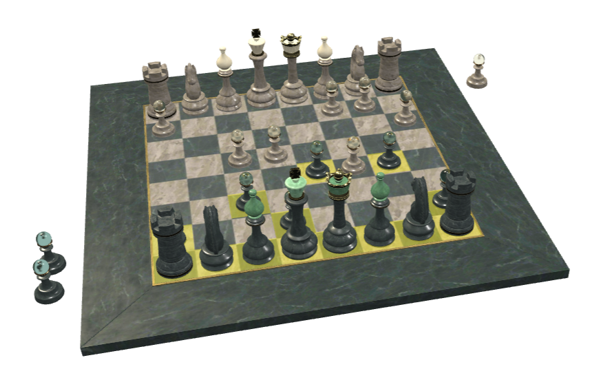

# A Beautiful Game - Chess Interactivity

## Screenshot

## Description

Click a piece of the side to move (gold squares), then a green square or an enemy piece to move or capture. Take the king to win.

## Source

The chessboard and pieces are the Khronos glTF Sample Asset [A Beautiful Game](https://github.com/KhronosGroup/glTF-Sample-Assets/tree/main/Models/ABeautifulGame).

Changes made for this sample: the pieces were moved from the game position of the original model to the chess starting position, clickable squares were added, and the KHR_interactivity graph (game rules, highlights, animations, events) was added.

## License Information

Chessboard and pieces, from [A Beautiful Game](https://github.com/KhronosGroup/glTF-Sample-Assets/tree/main/Models/ABeautifulGame):

- Original model: &copy; 2020, ASWF / MaterialX Project. Crafted by Moeen Sayed and Mujtaba Sayed for a SideFX tutorial for Karma. [CC BY 4.0](https://creativecommons.org/licenses/by/4.0/legalcode)
- Conversion to glTF: &copy; 2022, Ed Mackey. [CC BY 4.0](https://creativecommons.org/licenses/by/4.0/legalcode)

Interactivity: donated by Needle.

This model is licensed under a Creative Commons Attribution 4.0 International License.
