# glTF 2.0 Sample Assets

## Models tagged with **interactivity** and **showcase**

Models that demonstrate interactive features of glTF.

| Model   | Description |
|---------|-------------|
| [Calculator](Calculator/README.md) [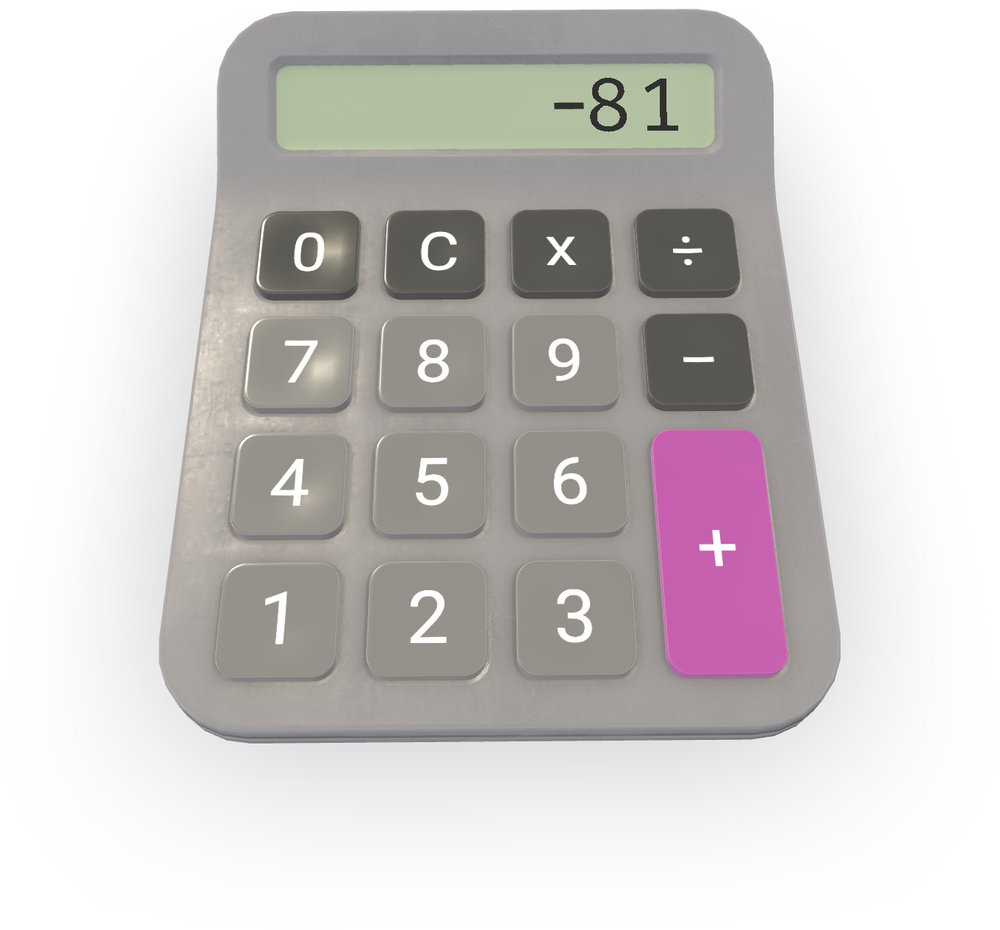](Calculator/README.md) [Show](https://gltf-interactivity.needle.tools?model=https://raw.GithubUserContent.com/KhronosGroup/glTF-Interactivity-Sample-Assets/main/Models/Calculator/glTF-Binary/Calculator.glb) – [Download GLB](https://raw.GithubUserContent.com/KhronosGroup/glTF-Interactivity-Sample-Assets/main/Models/Calculator/glTF-Binary/Calculator.glb) |  |
| [Construction Site](ConstructionSite/README.md)  [Show](https://gltf-interactivity.needle.tools?model=https://raw.GithubUserContent.com/KhronosGroup/glTF-Interactivity-Sample-Assets/main/Models/ConstructionSite/glTF-Binary/ConstructionSite.glb) – [Download GLB](https://raw.GithubUserContent.com/KhronosGroup/glTF-Interactivity-Sample-Assets/main/Models/ConstructionSite/glTF-Binary/ConstructionSite.glb) | Click the lamps to activate them. |
| [Ghost](Ghost/README.md) [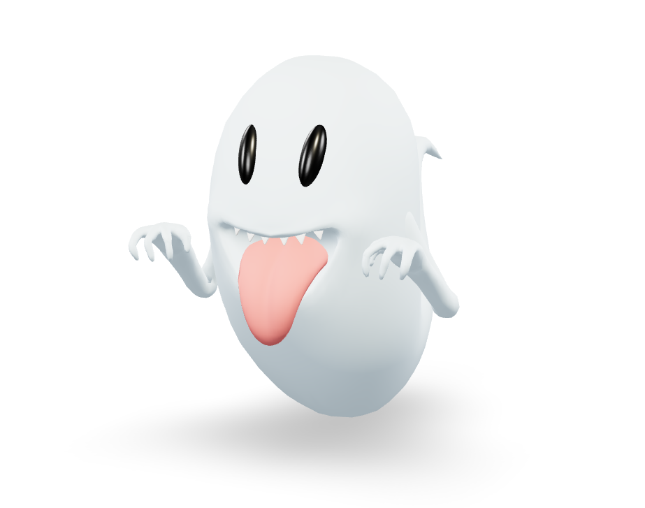](Ghost/README.md) [Show](https://gltf-interactivity.needle.tools?model=https://raw.GithubUserContent.com/KhronosGroup/glTF-Interactivity-Sample-Assets/main/Models/Ghost/glTF-Binary/ghost_v2.glb) – [Download GLB](https://raw.GithubUserContent.com/KhronosGroup/glTF-Interactivity-Sample-Assets/main/Models/Ghost/glTF-Binary/ghost_v2.glb) | Hover over the ghost to trigger animation |
| [Magic Ball](MagicBall/README.md) [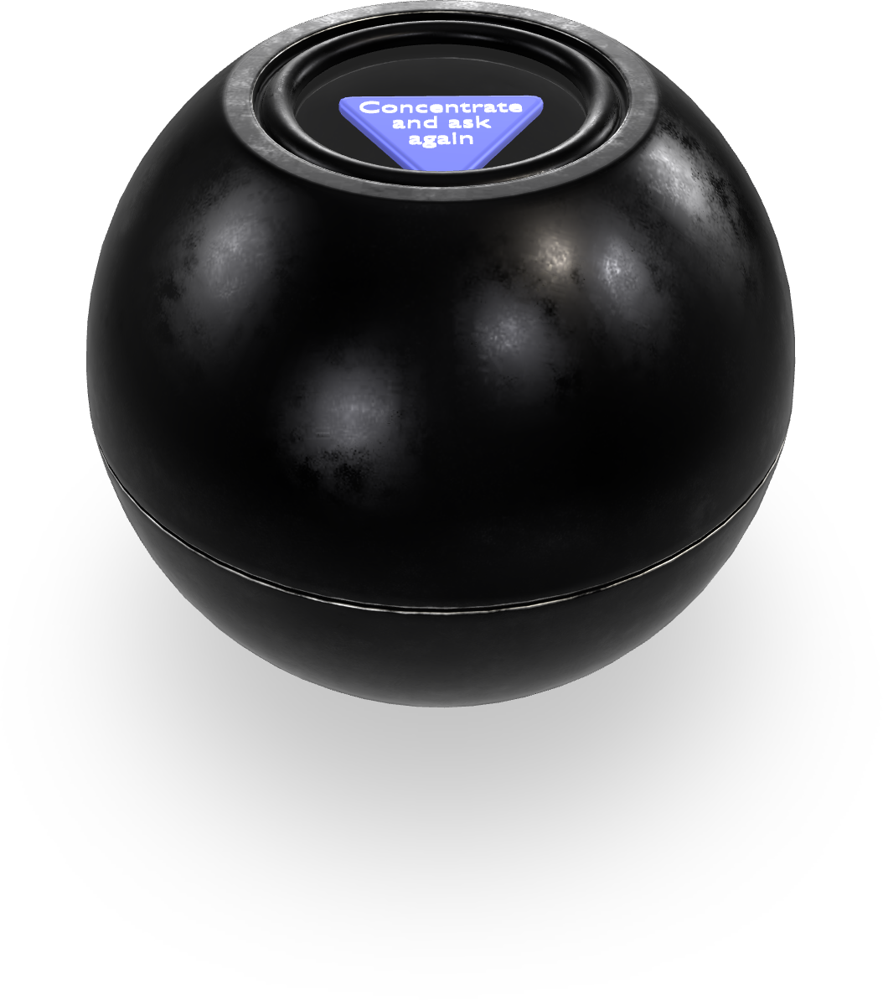](MagicBall/README.md) [Show](https://gltf-interactivity.needle.tools?model=https://raw.GithubUserContent.com/KhronosGroup/glTF-Interactivity-Sample-Assets/main/Models/MagicBall/glTF-Binary/MagicBall.glb) – [Download GLB](https://raw.GithubUserContent.com/KhronosGroup/glTF-Interactivity-Sample-Assets/main/Models/MagicBall/glTF-Binary/MagicBall.glb) | Click on the center of the ball to shuffle the texts. |
| [Snail Race](SnailRace/README.md) [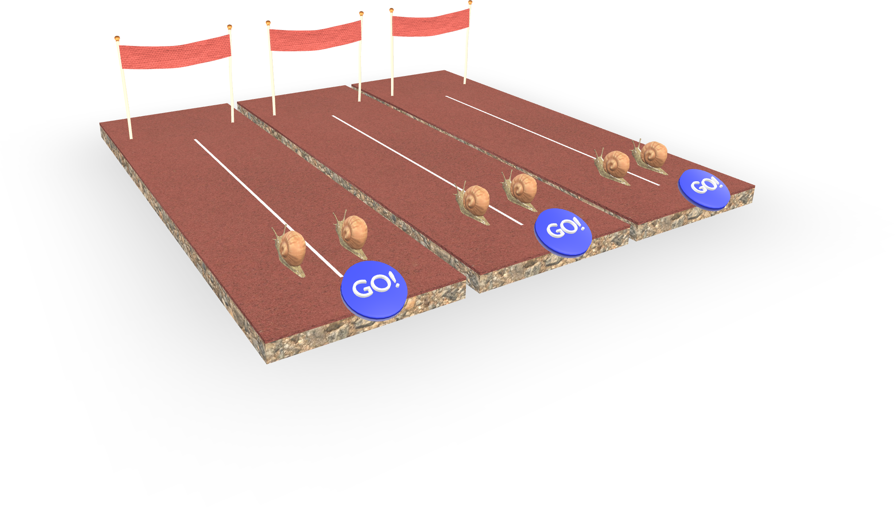](SnailRace/README.md) [Show](https://gltf-interactivity.needle.tools?model=https://raw.GithubUserContent.com/KhronosGroup/glTF-Interactivity-Sample-Assets/main/Models/SnailRace/glTF-Binary/SnailRace.glb) – [Download GLB](https://raw.GithubUserContent.com/KhronosGroup/glTF-Interactivity-Sample-Assets/main/Models/SnailRace/glTF-Binary/SnailRace.glb) | Click on one of the GO-buttons, to trigger a movement. |
| [Sundial](Sundial/README.md) [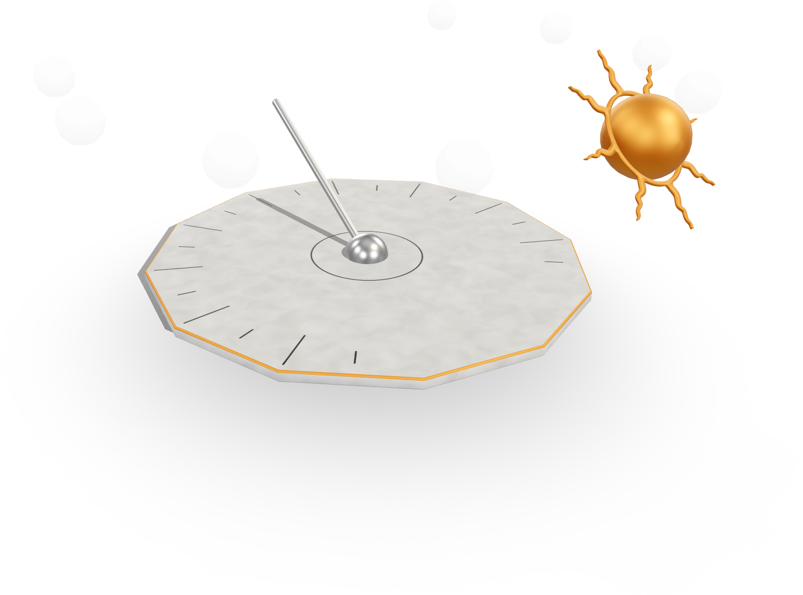](Sundial/README.md) [Show](https://gltf-interactivity.needle.tools?model=https://raw.GithubUserContent.com/KhronosGroup/glTF-Interactivity-Sample-Assets/main/Models/Sundial/glTF-Binary/Sundial.glb) – [Download GLB](https://raw.GithubUserContent.com/KhronosGroup/glTF-Interactivity-Sample-Assets/main/Models/Sundial/glTF-Binary/Sundial.glb) | Click on one the spheres to move the sun to it. |
| [Traffic Light](TrafficLight/README.md) [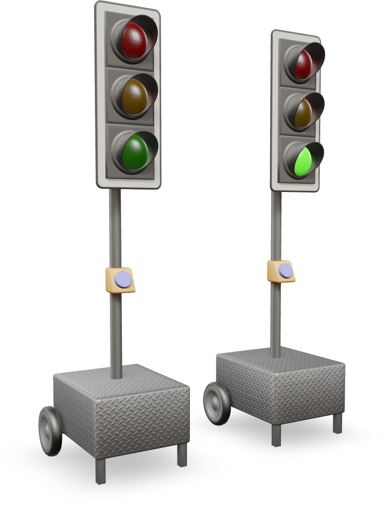](TrafficLight/README.md) [Show](https://gltf-interactivity.needle.tools?model=https://raw.GithubUserContent.com/KhronosGroup/glTF-Interactivity-Sample-Assets/main/Models/TrafficLight/glTF-Binary/TrafficLight.glb) – [Download GLB](https://raw.GithubUserContent.com/KhronosGroup/glTF-Interactivity-Sample-Assets/main/Models/TrafficLight/glTF-Binary/TrafficLight.glb) | Left Traffic Light: Click on the button to start the sequence. Right Traffic Light: Click on the button to switch to next phase. |
| [Puzzle](Puzzle/README.md) [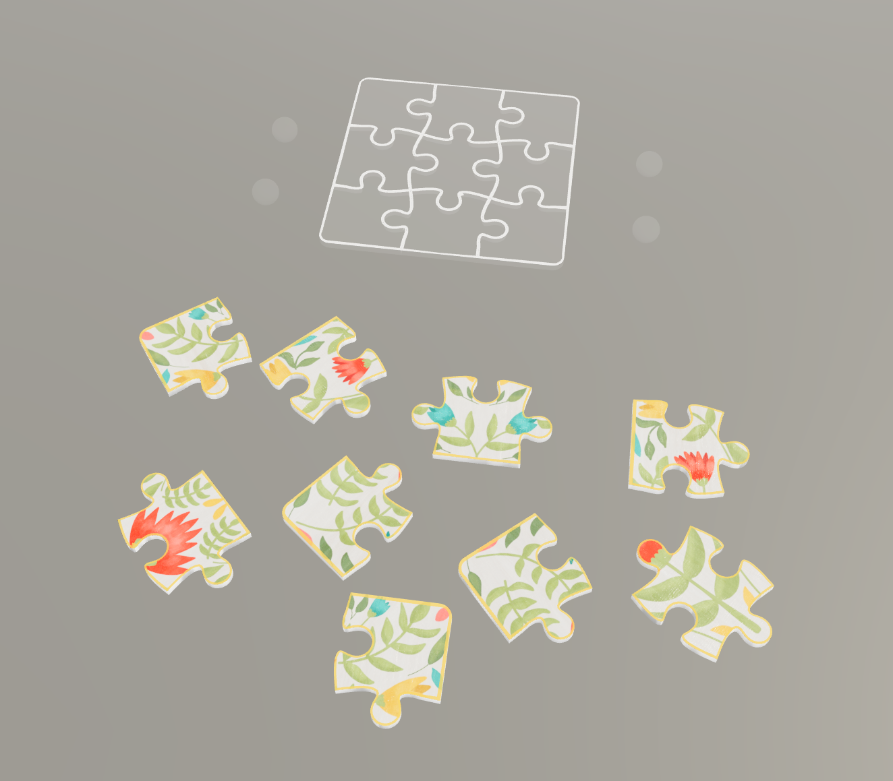](Puzzle/README.md) [Show](https://gltf-interactivity.needle.tools?model=https://raw.GithubUserContent.com/KhronosGroup/glTF-Interactivity-Sample-Assets/main/Models/Puzzle/glTF-Binary/PlaceOnClickPuzzle.glb) – [Download GLB](https://raw.GithubUserContent.com/KhronosGroup/glTF-Interactivity-Sample-Assets/main/Models/Puzzle/glTF-Binary/PlaceOnClickPuzzle.glb) | Select a puzzle piece and then click on one of the fields or spheres, to let move it to the position. |
| [Events](Events/README.md) [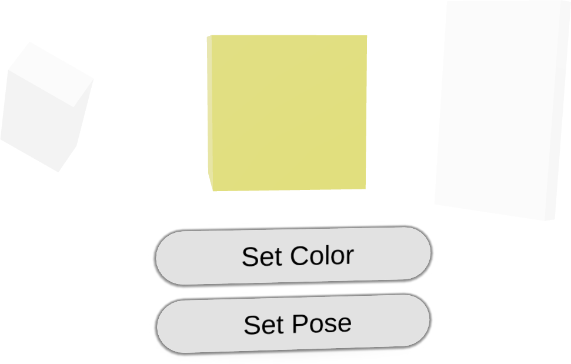](Events/README.md) [Show](https://gltf-interactivity.needle.tools?model=https://raw.GithubUserContent.com/KhronosGroup/glTF-Interactivity-Sample-Assets/main/Models/Events/glTF-Binary/Events.glb) – [Download GLB](https://raw.GithubUserContent.com/KhronosGroup/glTF-Interactivity-Sample-Assets/main/Models/Events/glTF-Binary/Events.glb) |  |
| [WhackAMole](WhackAMole/README.md) [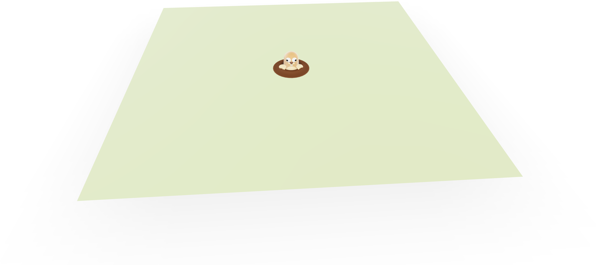](WhackAMole/README.md) [Show](https://gltf-interactivity.needle.tools?model=https://raw.GithubUserContent.com/KhronosGroup/glTF-Interactivity-Sample-Assets/main/Models/WhackAMole/glTF-Binary/WhackAMole.glb) – [Download GLB](https://raw.GithubUserContent.com/KhronosGroup/glTF-Interactivity-Sample-Assets/main/Models/WhackAMole/glTF-Binary/WhackAMole.glb) | Click on the moles to get disappear them |
| [Bow Shooting](BowShooting/README.md) [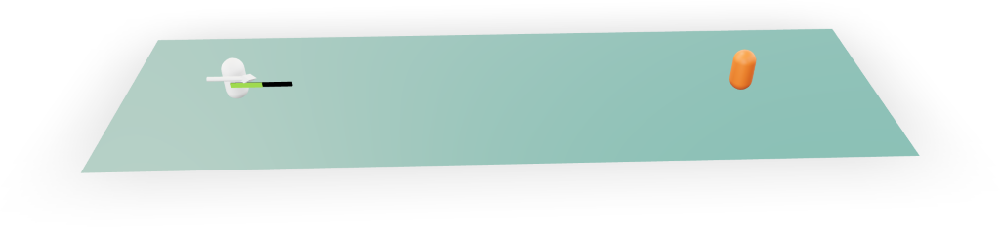](BowShooting/README.md) [Show](https://gltf-interactivity.needle.tools?model=https://raw.GithubUserContent.com/KhronosGroup/glTF-Interactivity-Sample-Assets/main/Models/BowShooting/glTF-Binary/BowShooting.glb) – [Download GLB](https://raw.GithubUserContent.com/KhronosGroup/glTF-Interactivity-Sample-Assets/main/Models/BowShooting/glTF-Binary/BowShooting.glb) | Click at first on the ground plane to lock the angle, click again to select the strengh. |
| [Flocking](Flocking/README.md) [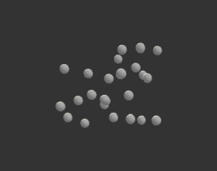](Flocking/README.md) [Show](https://gltf-interactivity.needle.tools?model=https://raw.GithubUserContent.com/KhronosGroup/glTF-Interactivity-Sample-Assets/main/Models/Flocking/glTF-Binary/Flocking.glb) – [Download GLB](https://raw.GithubUserContent.com/KhronosGroup/glTF-Interactivity-Sample-Assets/main/Models/Flocking/glTF-Binary/Flocking.glb) |  |
| [Physics Math](PhysicsMath/README.md) [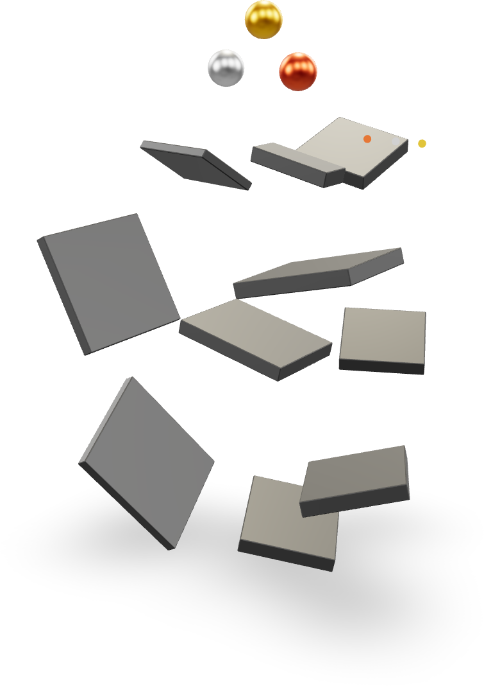](PhysicsMath/README.md) [Show](https://gltf-interactivity.needle.tools?model=https://raw.GithubUserContent.com/KhronosGroup/glTF-Interactivity-Sample-Assets/main/Models/PhysicsMath/glTF-Binary/PhysicsMath.glb) – [Download GLB](https://raw.GithubUserContent.com/KhronosGroup/glTF-Interactivity-Sample-Assets/main/Models/PhysicsMath/glTF-Binary/PhysicsMath.glb) | Optional: Click on a ball to reset the position. |

---

### Copyright

&copy; 2025, The Khronos Group and Needle.

**License:** [Creative Commons Attribtution 4.0 International](https://creativecommons.org/licenses/by/4.0/legalcode)