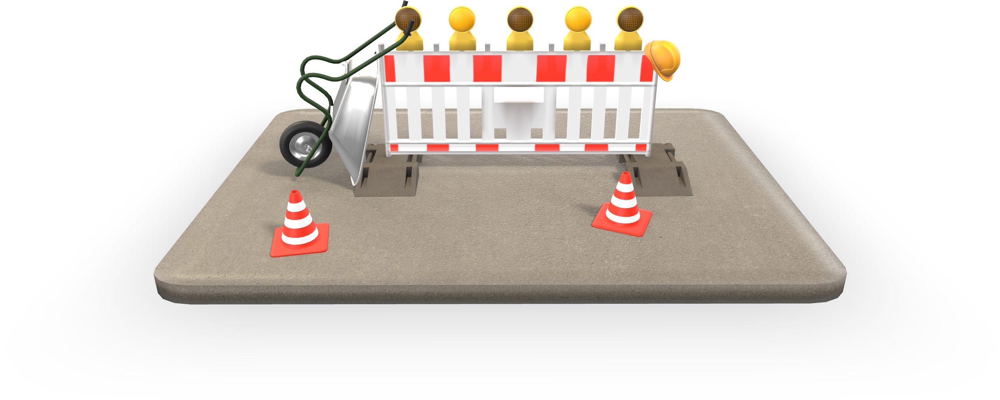

# glTF 2.0 Sample Assets

## Models tagged with **interactivity** and **showcase**

Models that demonstrate interactive features of glTF.

| Model   | Description |
|---------|-------------|
| [Calculator](Calculator/README.md)  [Show](https://gltf-interactivity.needle.tools?model=https://raw.GithubUserContent.com/KhronosGroup/glTF-Interactivity-Sample-Assets/main/Models/Calculator/glTF-Binary/Calculator.glb) – [Download GLB](https://raw.GithubUserContent.com/KhronosGroup/glTF-Interactivity-Sample-Assets/main/Models/Calculator/glTF-Binary/Calculator.glb) | A very basic calculator. Click on the operation buttons (+, -, *, :) to modify the displayed value. |
| [Construction Site](ConstructionSite/README.md)  [Show](https://gltf-interactivity.needle.tools?model=https://raw.GithubUserContent.com/KhronosGroup/glTF-Interactivity-Sample-Assets/main/Models/ConstructionSite/glTF-Binary/ConstructionSite.glb) – [Download GLB](https://raw.GithubUserContent.com/KhronosGroup/glTF-Interactivity-Sample-Assets/main/Models/ConstructionSite/glTF-Binary/ConstructionSite.glb) | Click on the lights to enable them for a few seconds. They will turn off automatically. |
| [Magic Ball](MagicBall/README.md)  [Show](https://gltf-interactivity.needle.tools?model=https://raw.GithubUserContent.com/KhronosGroup/glTF-Interactivity-Sample-Assets/main/Models/MagicBall/glTF-Binary/MagicBall.glb) – [Download GLB](https://raw.GithubUserContent.com/KhronosGroup/glTF-Interactivity-Sample-Assets/main/Models/MagicBall/glTF-Binary/MagicBall.glb) | This magic ball gives you random pieces of advice. |
| [Snail Race](SnailRace/README.md)  [Show](https://gltf-interactivity.needle.tools?model=https://raw.GithubUserContent.com/KhronosGroup/glTF-Interactivity-Sample-Assets/main/Models/SnailRace/glTF-Binary/SnailRace.glb) – [Download GLB](https://raw.GithubUserContent.com/KhronosGroup/glTF-Interactivity-Sample-Assets/main/Models/SnailRace/glTF-Binary/SnailRace.glb) | This snail race demonstrates various ways of sending custom events, either randomly or in a controlled way. |
| [Sundial](Sundial/README.md)  [Show](https://gltf-interactivity.needle.tools?model=https://raw.GithubUserContent.com/KhronosGroup/glTF-Interactivity-Sample-Assets/main/Models/Sundial/glTF-Binary/Sundial.glb) – [Download GLB](https://raw.GithubUserContent.com/KhronosGroup/glTF-Interactivity-Sample-Assets/main/Models/Sundial/glTF-Binary/Sundial.glb) | The sundial asset demonstrates moving and rotating objects based on the transformation of other objects in the scene. |
| [Traffic Light](TrafficLight/README.md)  [Show](https://gltf-interactivity.needle.tools?model=https://raw.GithubUserContent.com/KhronosGroup/glTF-Interactivity-Sample-Assets/main/Models/TrafficLight/glTF-Binary/TrafficLight.glb) – [Download GLB](https://raw.GithubUserContent.com/KhronosGroup/glTF-Interactivity-Sample-Assets/main/Models/TrafficLight/glTF-Binary/TrafficLight.glb) | Demonstrates chaining flows and nodes as well as modifying material values. |

---

### Copyright

&copy; 2025, The Khronos Group and Needle.

**License:** [Creative Commons Attribtution 4.0 International](https://creativecommons.org/licenses/by/4.0/legalcode)