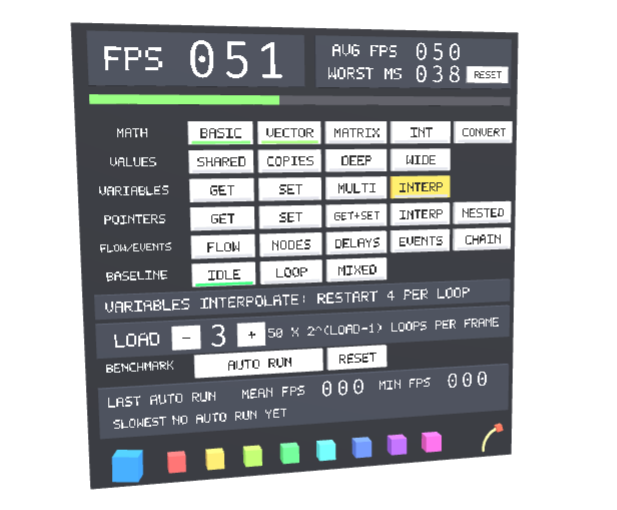

# Performance Test

## Screenshot

## Description

Measures graph execution cost. Pick a workload (math, value evaluation, variables, pointers, flow, events or mixed) and a load level (1-9, 50 * 2^(level-1) loop iterations per tick); the FPS counter and bar show the result. AUTO RUN measures every workload, logs the results and shows a summary.

## License Information

Donated by Needle for glTF testing.

This model is licensed under a Creative Commons Attribution 4.0 International License.
